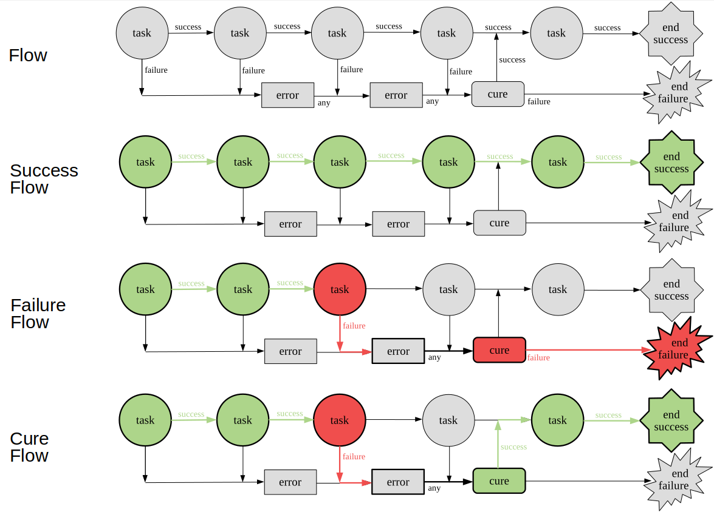

# RWF

Simple Ruby Workflow

## Installation

```sh
gem install rwf
```

## Direct flow diagram



## Usage

```rb
# my_flow.rb
require 'rwf'

class NestedFlow < RWF::Flow
  task :fail_task

  def fail_task(*)
    puts 'am nested and i know it'
    false # return falsey - task result is failure
  end
end

class MyFlow < RWF::Flow
  task :task1
  task ->(*) { puts('lambda'); true }
  task NestedFlow
  error :error_task
  task :skipped_task
  cure :cure_task
  task :after_cure

  def task1(*)
    puts 'task1'
    true # return truthy - task result would be `success`
  end

  def error_task(params, *)
    puts 'error_task'
    params[:some_output] = 'hi from error_task'
  end

  def skipped_task(*)
    raise 'that task should not be called - flow state is now a `failure`'
  end

  # note that we can read some output of previous steps
  def cure_task(_params, some_output:, **)
    puts 'cure_task'
    puts "some output: '#{some_output}'"
    true # success of `cure` task restores the flow's state
  end

  # that task was called because the flow was cured
  def after_cure(*)
    puts 'after_cure'
    true
  end
end

MyFlow.()
```

The output would be:

```sh
ruby my_flow.rb
task1
lambda
am nested and i know it
error_task
cure_task
some output: 'hi from error_task'
after_cure
```
